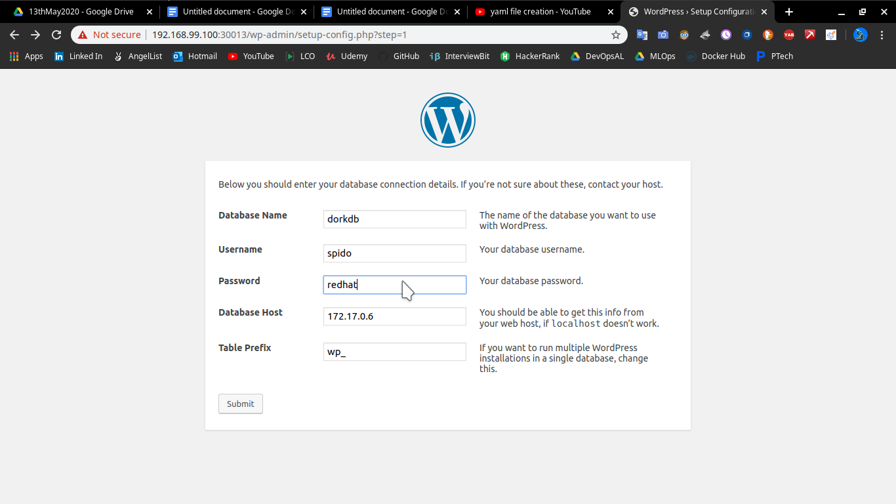

+ launch WordPress using kubernetes
+ use mysql as database server
+ create deployment using wordpress-php-apache image
+ WordPress is a free and open-source content management system written in PHP and paired with a MySQL or MariaDB database. Features include a plugin architecture and a template system, referred to within WordPress as Themes.

